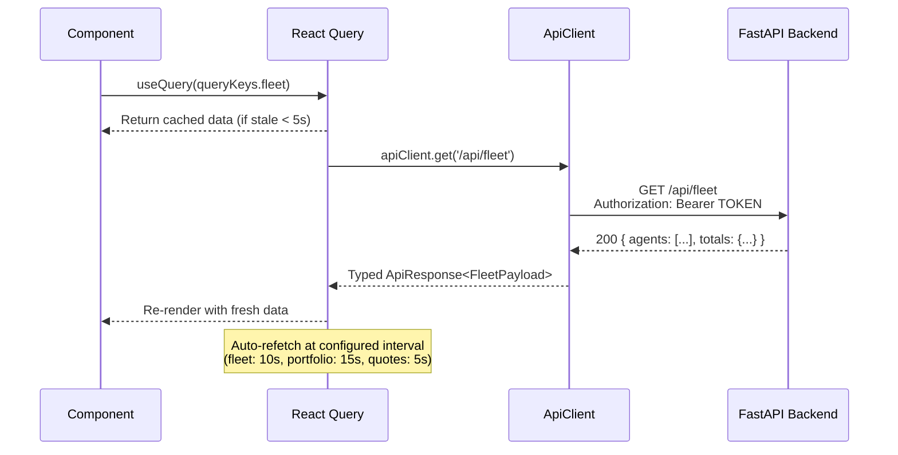
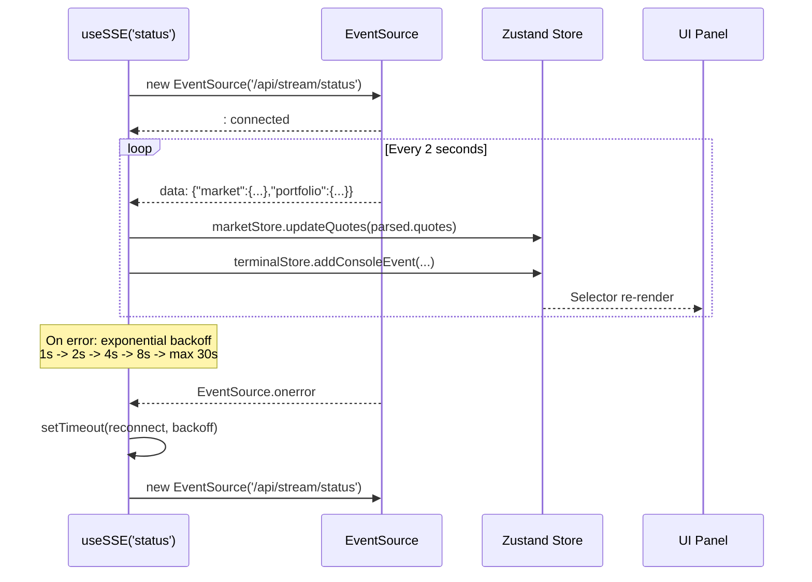
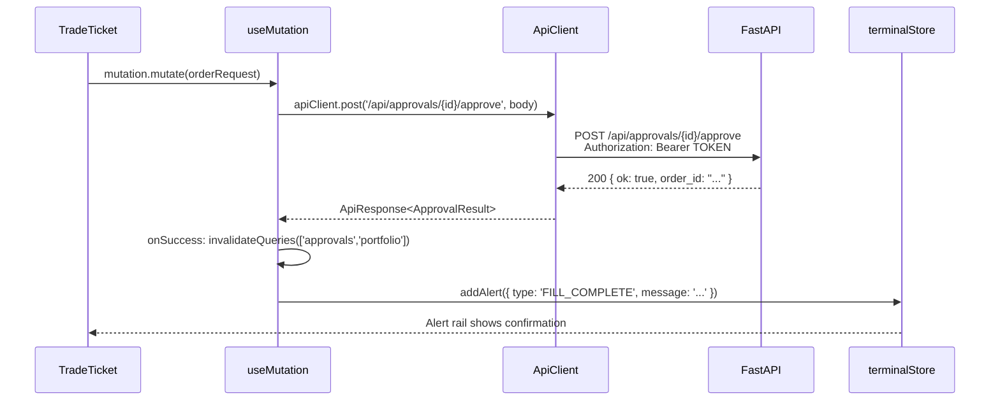
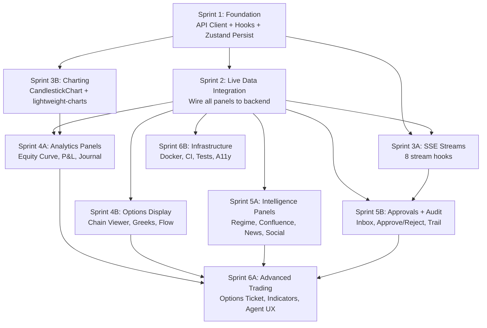

# Trading Terminal -- Complete Technical Architecture

> **Version**: 1.0.0  
> **Author**: Atlas (Staff Architect)  
> **Date**: 2026-05-26  
> **Status**: APPROVED FOR IMPLEMENTATION  

---

## Table of Contents

1. [System Architecture Diagram](#1-system-architecture-diagram)
2. [Data Flow Diagrams](#2-data-flow-diagrams)
3. [Directory Structure](#3-directory-structure)
4. [TypeScript Interfaces](#4-typescript-interfaces)
5. [API Contract Mapping](#5-api-contract-mapping)
6. [Phased Sprint Plan](#6-phased-sprint-plan)
7. [Dependency Graph](#7-dependency-graph)
8. [Component Trees](#8-component-trees)

---

## 1. System Architecture Diagram

```mermaid
graph TB
    subgraph "Browser (React 18 + Vite)"
        UI[TerminalShell<br/>3-Panel Layout]
        RQ[React Query<br/>Cache Layer]
        ZS[Zustand Stores<br/>terminalStore + marketStore]
        SSE_H[useSSE Hook<br/>EventSource Manager]
        WS_H[useWebSocket Hook<br/>WebSocket Manager]
        API_C[ApiClient<br/>src/lib/api/client.ts]
    end

    subgraph "Vite Dev Server (:5173)"
        PROXY[Proxy /api -> :8080<br/>Proxy /ws -> ws://:8080]
    end

    subgraph "SelfAgentBot FastAPI (:8080)"
        subgraph "REST Endpoints"
            STATUS[GET /api/status]
            FLEET[GET /api/fleet]
            TRADES[GET /api/trades]
            PORTFOLIO[GET /api/portfolio]
            APPROVALS[GET /api/approvals]
            AUDIT[GET /api/audit]
            QUOTES[GET /api/quotes]
            CHART[GET /api/chart/:symbol]
            SIGNALS[GET /api/signal-dashboard]
            RISK[GET /api/risk]
            MOMENTUM[GET /api/momentum.*]
            NEWS[GET /api/news-with-options]
            EXCEPTIONS[GET /api/exceptions]
            HEADER[GET /api/header-summary]
        end

        subgraph "SSE Streams"
            SSE1[/api/stream/status<br/>2s interval]
            SSE2[/api/trades/stream<br/>trade_events.jsonl tail]
            SSE3[/api/signals/stream<br/>fired_log tail]
            SSE4[/api/alerts/stream<br/>rejected_signals tail]
            SSE5[/api/flow/stream<br/>options flow]
            SSE6[/api/approvals/stream<br/>pending mutations]
            SSE7[/api/logs/stream<br/>fleet-wide logs]
            SSE8[/api/signal-dashboard/stream<br/>30s interval]
        end

        subgraph "Mutating POST (token-gated)"
            POST1[POST /api/agent/:name/start]
            POST2[POST /api/agent/:name/stop]
            POST3[POST /api/agent/:name/restart]
            POST4[POST /api/approvals/:id/approve]
            POST5[POST /api/approvals/:id/reject]
            POST6[POST /api/risk/settings]
            POST7[POST /api/watchlist/alerts]
            POST8[POST /api/backtest/run]
        end
    end

    subgraph "Backend Data Sources"
        FS[shared/*.json<br/>agents/*/trades/*.json<br/>logs/*.log]
        RH[Robinhood MCP<br/>Live Broker]
        YF[yfinance<br/>Market Data]
        EODHD[EODHD API<br/>Index Fallback]
        REDIS[Redis<br/>Heartbeats]
        SQLITE[SQLite<br/>Audit + LLM Cost]
    end

    UI --> RQ
    UI --> ZS
    RQ --> API_C
    SSE_H --> ZS
    WS_H --> ZS
    API_C --> PROXY
    SSE_H --> PROXY
    WS_H --> PROXY

    PROXY --> STATUS
    PROXY --> FLEET
    PROXY --> TRADES
    PROXY --> PORTFOLIO
    PROXY --> APPROVALS
    PROXY --> SSE1
    PROXY --> SSE2
    PROXY --> SSE3
    PROXY --> SSE4
    PROXY --> SSE5
    PROXY --> SSE6

    STATUS --> FS
    FLEET --> FS
    FLEET --> REDIS
    PORTFOLIO --> RH
    PORTFOLIO --> FS
    QUOTES --> YF
    QUOTES --> EODHD
    CHART --> YF
    AUDIT --> SQLITE
    AUDIT --> FS
```

---

## 2. Data Flow Diagrams

### 2.1 REST Polling via React Query



### 2.2 SSE Stream Data Flow



### 2.3 Mutation Flow (Order Submit / Agent Control)



### 2.4 SSE Event Routing Map

```mermaid
graph LR
    subgraph "SSE Endpoints"
        S1[/api/stream/status]
        S2[/api/trades/stream]
        S3[/api/signals/stream]
        S4[/api/alerts/stream]
        S5[/api/flow/stream]
        S6[/api/approvals/stream]
        S7[/api/logs/stream]
        S8[/api/signal-dashboard/stream]
    end

    subgraph "Zustand Stores"
        MS[marketStore<br/>quotes, isMarketOpen]
        TS[terminalStore<br/>alerts, consoleEvents]
    end

    subgraph "React Query Cache"
        QF[queryKeys.fleet]
        QP[queryKeys.portfolio]
        QT[queryKeys.trades]
        QA[queryKeys.approvals]
        QS[queryKeys.signals]
    end

    subgraph "UI Panels"
        WL[WatchlistPanel]
        TK[TickerTape]
        OB[OrderBlotter]
        SF[SignalFeed]
        AP[AgentsPanel]
        AR[AlertRail]
        AI[ApprovalsInbox]
        TC[TerminalConsole]
    end

    S1 -->|quotes + market state| MS
    S1 -->|system events| TS
    MS --> WL
    MS --> TK

    S2 -->|new trade events| QT
    QT --> OB

    S3 -->|fired signals| QS
    QS --> SF

    S4 -->|rejected signals| TS
    TS --> AR
    TS --> TC

    S5 -->|options flow| QS

    S6 -->|added/removed approvals| QA
    QA --> AI

    S7 -->|log lines| TS
    TS --> TC

    S8 -->|signal dashboard refresh| QS
```

---

## 3. Directory Structure

All paths below are relative to `src/`. Files marked `[NEW]` do not exist yet.

```
src/
|-- main.tsx                          # QueryClient + BrowserRouter (exists)
|-- App.tsx                           # Root layout + tab routing (exists -- will be refactored)
|-- index.css                         # Tailwind base + custom animations (exists)
|
|-- lib/                              # [NEW] Core infrastructure layer
|   |-- api/
|   |   |-- client.ts                 # [NEW] Typed fetch wrapper (auth, retry, error handling)
|   |   |-- endpoints.ts              # [NEW] All endpoint constants matching SelfAgentBot routes
|   |   |-- queryKeys.ts              # [NEW] Enum-like object for React Query cache keys
|   |   `-- queryClient.ts            # [NEW] QueryClient factory (move from main.tsx)
|   |-- env.ts                        # [NEW] Vite env config reader (VITE_API_BASE_URL, etc.)
|   `-- errors.ts                     # [NEW] ApiError class, error serialization
|
|-- hooks/                            # [NEW] Shared custom hooks
|   |-- useSSE.ts                     # [NEW] EventSource hook with reconnect/backoff
|   |-- useWebSocket.ts              # [NEW] WebSocket hook with reconnect/backoff
|   |-- useApiQuery.ts               # [NEW] Thin wrapper: useQuery + apiClient + error toast
|   |-- useApiMutation.ts            # [NEW] Thin wrapper: useMutation + apiClient + invalidation
|   |-- useKeyboardNavigation.ts     # [NEW] Panel focus keyboard shortcuts
|   |-- useInterval.ts               # [NEW] setInterval hook (replace raw useEffect)
|   `-- useLocalStorage.ts           # [NEW] localStorage hook for persistence
|
|-- hooks/queries/                    # [NEW] Per-domain React Query hooks
|   |-- useFleet.ts                  # [NEW] useQuery for /api/fleet -> AgentsPanel
|   |-- usePortfolio.ts             # [NEW] useQuery for /api/portfolio -> PositionsGrid
|   |-- useTrades.ts                # [NEW] useQuery for /api/trades -> OrderBlotter
|   |-- useSignalDashboard.ts       # [NEW] useQuery for /api/signal-dashboard -> SignalFeed
|   |-- useApprovals.ts             # [NEW] useQuery for /api/approvals -> ApprovalsInbox
|   |-- useAudit.ts                 # [NEW] useQuery for /api/audit -> AuditTrail
|   |-- useQuotes.ts                # [NEW] useQuery for /api/quotes -> TickerTape
|   |-- useChart.ts                 # [NEW] useQuery for /api/chart/:symbol -> CandlestickChart
|   |-- useRisk.ts                  # [NEW] useQuery for /api/risk -> RiskPanel
|   |-- useHeaderSummary.ts         # [NEW] useQuery for /api/header-summary -> GlobalCommandBar
|   |-- useMomentum.ts              # [NEW] useQuery for /api/momentum.* -> MarketDataGrid
|   |-- useExceptions.ts            # [NEW] useQuery for /api/exceptions -> ExceptionQueue
|   |-- usePortfolioGreeks.ts       # [NEW] useQuery for /api/portfolio/greeks
|   |-- usePortfolioHistory.ts      # [NEW] useQuery for /api/portfolio/history
|   |-- useOptionsFlow.ts           # [NEW] useQuery for /api/options-flow-live
|   |-- useCalendar.ts              # [NEW] useQuery for /api/calendar
|   |-- useNews.ts                  # [NEW] useQuery for /api/news-with-options
|   |-- useSectors.ts               # [NEW] useQuery for /api/sectors
|   |-- useWatchlistAlerts.ts        # [NEW] useQuery for /api/watchlist/alerts
|   |-- useLlmCost.ts               # [NEW] useQuery for /api/llm-cost
|   `-- useBacktestResults.ts        # [NEW] useQuery for /api/backtest/results
|
|-- hooks/mutations/                  # [NEW] Per-domain React Query mutation hooks
|   |-- useAgentControl.ts           # [NEW] useMutation for /api/agent/:name/start|stop|restart
|   |-- useApprovalAction.ts         # [NEW] useMutation for /api/approvals/:id/approve|reject
|   |-- useRiskSettings.ts           # [NEW] useMutation for POST /api/risk/settings
|   |-- useWatchlistAlert.ts         # [NEW] useMutation for POST /api/watchlist/alerts
|   `-- useBacktestRun.ts            # [NEW] useMutation for POST /api/backtest/run
|
|-- hooks/streams/                    # [NEW] SSE stream hooks (one per stream)
|   |-- useStatusStream.ts           # [NEW] SSE /api/stream/status -> marketStore
|   |-- useTradesStream.ts           # [NEW] SSE /api/trades/stream -> invalidate trades
|   |-- useSignalsStream.ts          # [NEW] SSE /api/signals/stream -> invalidate signals
|   |-- useAlertsStream.ts           # [NEW] SSE /api/alerts/stream -> terminalStore.addAlert
|   |-- useFlowStream.ts            # [NEW] SSE /api/flow/stream -> options flow state
|   |-- useApprovalsStream.ts        # [NEW] SSE /api/approvals/stream -> invalidate approvals
|   |-- useLogsStream.ts             # [NEW] SSE /api/logs/stream -> terminalStore console
|   `-- useSignalDashboardStream.ts  # [NEW] SSE /api/signal-dashboard/stream
|
|-- stores/
|   |-- terminalStore.ts             # (exists) -- add persist middleware
|   |-- marketStore.ts               # (exists) -- add persist middleware for watchlist
|   `-- connectionStore.ts           # [NEW] SSE/WS connection state, health indicators
|
|-- types/
|   |-- market.ts                    # (exists)
|   |-- signals.ts                   # (exists)
|   |-- orders.ts                    # (exists)
|   |-- portfolio.ts                 # (exists)
|   |-- risk.ts                      # (exists)
|   |-- ai.ts                        # (exists)
|   |-- audit.ts                     # (exists)
|   |-- ws.ts                        # (exists)
|   |-- agents.ts                    # (exists)
|   |-- api.ts                       # [NEW] ApiResponse<T>, ApiError, SSEEvent, PaginatedResponse
|   |-- options.ts                   # [NEW] OptionsChain, OptionLeg, Greeks, OptionsFlow
|   |-- approvals.ts                 # [NEW] ApprovalRequest, ApprovalAction
|   `-- chart.ts                     # [NEW] Candle, ChartTimeframe, IndicatorConfig
|
|-- components/
|   |-- layout/
|   |   |-- TerminalShell.tsx         # (exists)
|   |   |-- GlobalCommandBar.tsx      # (exists -- wire to useHeaderSummary)
|   |   |-- TickerTape.tsx            # (exists -- wire to useQuotes + SSE)
|   |   |-- TerminalConsole.tsx       # (exists -- wire to useLogsStream)
|   |   `-- ErrorBoundary.tsx         # [NEW] Extract from App.tsx, add retry/reset button
|   |
|   |-- shared/
|   |   |-- CommandPalette.tsx        # (exists)
|   |   |-- AlertRail.tsx             # (exists)
|   |   |-- DataTable.tsx             # (exists)
|   |   |-- LoadingSkeletons.tsx      # (exists)
|   |   |-- StatusBadge.tsx           # (exists)
|   |   |-- NumberDisplay.tsx         # (exists)
|   |   |-- Sparkline.tsx             # (exists)
|   |   |-- TerminalButton.tsx        # (exists)
|   |   |-- TerminalInput.tsx         # (exists)
|   |   |-- ConfirmationDialog.tsx    # [NEW] Radix AlertDialog for mode toggle / kill switch
|   |   |-- ConnectionIndicator.tsx   # [NEW] SSE/API health dot in command bar
|   |   `-- EmptyState.tsx            # [NEW] "No data" placeholder with retry action
|   |
|   |-- market/
|   |   |-- WatchlistPanel.tsx        # (exists -- wire to useQuotes)
|   |   |-- MarketDataGrid.tsx        # (exists)
|   |   |-- PriceCell.tsx             # (exists)
|   |   `-- MiniChart.tsx             # (exists)
|   |
|   |-- trading/
|   |   |-- PositionsGrid.tsx         # (exists -- wire to usePortfolio)
|   |   |-- TradeTicket.tsx           # (exists -- wire to useApiMutation)
|   |   `-- OrderBlotter.tsx          # (exists -- wire to useTrades + useTradesStream)
|   |
|   |-- signals/
|   |   |-- SignalFeed.tsx            # (exists -- wire to useSignalDashboard)
|   |   |-- SignalCard.tsx            # (exists)
|   |   `-- SignalBadge.tsx           # (exists)
|   |
|   |-- risk/
|   |   |-- RiskPanel.tsx             # (exists -- wire to useRisk)
|   |   |-- RiskGauge.tsx             # (exists)
|   |   `-- KillSwitchButton.tsx      # (exists -- wire to mutation)
|   |
|   |-- ai/
|   |   |-- AIAnalysisCard.tsx        # (exists)
|   |   `-- AIRecommendationPanel.tsx # (exists)
|   |
|   |-- agents/
|   |   |-- AgentsPanel.tsx           # (exists -- wire to useFleet)
|   |   |-- AgentCard.tsx             # [NEW] Per-agent row with status/heartbeat/controls
|   |   |-- AgentLogViewer.tsx        # [NEW] Streaming log viewer for single agent
|   |   |-- AgentTimeline.tsx         # [NEW] Timeline/trace viewer
|   |   `-- AgentConfigModal.tsx      # [NEW] Edit agent config (Radix Dialog)
|   |
|   |-- chart/                        # [NEW] Charting components
|   |   |-- CandlestickChart.tsx      # [NEW] TradingView lightweight-charts wrapper
|   |   |-- TimeframeSelector.tsx     # [NEW] 1m/5m/15m/1h/4h/1D/1W toggle
|   |   |-- IndicatorOverlay.tsx      # [NEW] RSI/MACD/BB/EMA selector + config
|   |   |-- VolumeProfile.tsx         # [NEW] Volume bars below chart
|   |   `-- ChartContainer.tsx        # [NEW] Composition root: chart + timeframe + indicators
|   |
|   |-- options/                      # [NEW] Options-related components
|   |   |-- OptionsChainViewer.tsx    # [NEW] Strike/expiry matrix with greeks
|   |   |-- OptionsFlowFeed.tsx       # [NEW] Unusual activity live feed
|   |   |-- GEXChart.tsx              # [NEW] Gamma exposure visualization
|   |   |-- IVChart.tsx               # [NEW] IV rank / percentile chart
|   |   |-- OptionsTradeTicket.tsx    # [NEW] Multi-leg spread builder
|   |   `-- GreeksSummary.tsx         # [NEW] Portfolio-level Greeks display
|   |
|   |-- analytics/                    # [NEW] Analytics panels
|   |   |-- EquityCurve.tsx           # [NEW] Cumulative P&L line chart (recharts)
|   |   |-- AgentPnLAttribution.tsx   # [NEW] Per-agent P&L bars
|   |   |-- TradeJournal.tsx          # [NEW] Trade journal viewer
|   |   |-- PerformanceMetrics.tsx    # [NEW] Win rate / Sharpe / Sortino cards
|   |   |-- CorrelationMatrix.tsx     # [NEW] Heatmap of position correlations
|   |   |-- SectorExposure.tsx        # [NEW] Pie chart of sector weights
|   |   |-- DrawdownChart.tsx         # [NEW] Waterfall drawdown visualization
|   |   |-- VaRDisplay.tsx            # [NEW] Value at Risk gauge
|   |   |-- MonthlyPnLCalendar.tsx    # [NEW] Calendar heatmap of daily P&L
|   |   `-- EarningsCalendar.tsx      # [NEW] Upcoming earnings with implied moves
|   |
|   |-- intelligence/                 # [NEW] Intelligence & workflow panels
|   |   |-- MarketRegimeBadge.tsx     # [NEW] Bull/Bear Quiet/Volatile indicator
|   |   |-- ConfluencePanel.tsx       # [NEW] Multi-source signal agreement
|   |   |-- NewsSentimentFeed.tsx     # [NEW] News with sentiment tags
|   |   |-- SocialBuzzPanel.tsx       # [NEW] Reddit/StockTwits buzz
|   |   |-- ShortSqueezeScanner.tsx   # [NEW] Squeeze candidates
|   |   `-- DarkPoolFeed.tsx          # [NEW] Block print activity
|   |
|   |-- approvals/                    # [NEW] Approval workflow
|   |   |-- ApprovalsInbox.tsx        # [NEW] Pending staged orders list
|   |   |-- ApprovalCard.tsx          # [NEW] Single approval with approve/reject
|   |   `-- ApprovalDetail.tsx        # [NEW] Expanded approval with reasoning
|   |
|   |-- audit/                        # [NEW] Audit & observability
|   |   |-- AuditTrailViewer.tsx      # [NEW] Merged timeline from 5 sources
|   |   `-- ExceptionQueuePanel.tsx   # [NEW] Severity-coded exception feed
|   |
|   `-- settings/                     # [NEW] Configuration panels
|       |-- RiskPolicyEditor.tsx      # [NEW] Risk limits editor
|       |-- AlertRuleBuilder.tsx      # [NEW] Custom alert conditions
|       `-- NotificationPrefs.tsx     # [NEW] Telegram / push config
|
|-- design-system/
|   |-- tokens.ts                     # (exists)
|   `-- components.ts                 # (exists)
|
`-- utils/
    |-- formatters.ts                 # (exists)
    `-- cn.ts                         # [NEW] clsx + tailwind-merge utility (already using clsx)
```

---

## 4. TypeScript Interfaces

### 4.1 API Response Types (`src/types/api.ts`)

```typescript
// ---- Generic API Response Wrapper ----

export interface ApiResponse<T> {
  data: T;
  status: number;
  headers: Headers;
  timestamp: number;
}

export interface ApiErrorResponse {
  detail: string;
  status: number;
  timestamp: number;
  path: string;
}

export class ApiError extends Error {
  status: number;
  detail: string;
  path: string;
  timestamp: number;

  constructor(response: ApiErrorResponse) {
    super(response.detail);
    this.name = 'ApiError';
    this.status = response.status;
    this.detail = response.detail;
    this.path = response.path;
    this.timestamp = response.timestamp;
  }

  get isUnauthorized(): boolean { return this.status === 401; }
  get isForbidden(): boolean { return this.status === 403; }
  get isNotFound(): boolean { return this.status === 404; }
  get isServerError(): boolean { return this.status >= 500; }
  get isRetryable(): boolean { return this.status >= 500 || this.status === 429; }
}

// ---- SSE Event Types ----

export interface SSEEvent<T = unknown> {
  type: string;
  data: T;
  lastEventId?: string;
  retry?: number;
}

export interface SSEConnectionState {
  status: 'connecting' | 'connected' | 'reconnecting' | 'disconnected' | 'error';
  lastEventAt: number | null;
  reconnectAttempts: number;
  error: string | null;
}

// ---- WebSocket Message Envelope ----

export interface WebSocketMessage<T = unknown> {
  type: string;
  payload: T;
  timestamp: number;
  correlationId?: string;
  sequenceNum?: number;
}

export interface WebSocketConnectionState {
  status: 'connecting' | 'connected' | 'reconnecting' | 'disconnected' | 'error';
  lastMessageAt: number | null;
  reconnectAttempts: number;
  latencyMs: number | null;
}

// ---- Paginated Response ----

export interface PaginatedResponse<T> {
  items: T[];
  count: number;
  total?: number;
  offset?: number;
  limit?: number;
}
```

### 4.2 Query Keys (`src/lib/api/queryKeys.ts`)

```typescript
export const queryKeys = {
  // ---- Core Data ----
  fleet:              ['fleet'] as const,
  fleetAgent:         (name: string) => ['fleet', name] as const,
  portfolio:          ['portfolio'] as const,
  portfolioOrders:    ['portfolio', 'orders'] as const,
  portfolioHistory:   (days: number) => ['portfolio', 'history', days] as const,
  portfolioGreeks:    ['portfolio', 'greeks'] as const,
  portfolioHeatmap:   ['portfolio', 'heatmap'] as const,

  // ---- Trading ----
  trades:             (view?: string) => ['trades', view ?? 'all'] as const,
  approvals:          ['approvals'] as const,

  // ---- Market Data ----
  quotes:             (tickers?: string) => ['quotes', tickers ?? 'default'] as const,
  chart:              (symbol: string, period: string, interval: string) =>
                        ['chart', symbol, period, interval] as const,
  headerSummary:      ['header-summary'] as const,

  // ---- Signals & Intelligence ----
  signalDashboard:    (filters?: Record<string, unknown>) =>
                        ['signal-dashboard', filters] as const,
  signals:            ['signals'] as const,

  // ---- Risk ----
  risk:               ['risk'] as const,
  riskSettings:       ['risk', 'settings'] as const,
  exceptions:         (filters?: Record<string, unknown>) =>
                        ['exceptions', filters] as const,
  exceptionQueue:     ['exception-queue'] as const,

  // ---- Analytics ----
  momentum:           (type: 'gainers' | 'losers' | 'surge' | 'market') =>
                        ['momentum', type] as const,
  sectors:            ['sectors'] as const,
  news:               ['news'] as const,
  newsWithOptions:    ['news-with-options'] as const,
  calendar:           ['calendar'] as const,
  calendarEarnings:   ['calendar', 'earnings'] as const,
  socialBuzz:         ['social-buzz'] as const,

  // ---- Agent Detail ----
  agentLogs:          (name: string, date?: string) =>
                        ['agent', name, 'logs', date] as const,
  agentTrades:        (name: string) => ['agent', name, 'trades'] as const,
  agentTimeline:      (name: string) => ['agent', name, 'timeline'] as const,
  agentInspect:       (name: string) => ['agent', name, 'inspect'] as const,

  // ---- Audit ----
  audit:              (filters?: Record<string, unknown>) =>
                        ['audit', filters] as const,

  // ---- Options ----
  optionsFlow:        ['options-flow-live'] as const,
  gex:                (symbol: string) => ['gex', symbol] as const,
  ivr:                (symbol: string) => ['ivr', symbol] as const,

  // ---- Other ----
  llmCost:            ['llm-cost'] as const,
  backtestResults:    ['backtest', 'results'] as const,
  backtestAgents:     ['backtest', 'agents'] as const,
  watchlists:         ['watchlists'] as const,
  watchlistAlerts:    ['watchlist', 'alerts'] as const,
  journal:            (date?: string) => ['journal', date ?? 'today'] as const,
  plays:              ['plays'] as const,
  hotInsights:        ['hot-insights'] as const,
  tradingPhase:       ['trading-phase'] as const,
  etfRotation:        ['etf-rotation'] as const,
  uiMode:             ['ui', 'mode'] as const,
  uiLayout:           ['ui', 'layout'] as const,
} as const;
```

### 4.3 API Client Type Signature (`src/lib/api/client.ts` pseudocode)

```typescript
interface ApiClientConfig {
  baseUrl: string;
  token?: string;
  timeout?: number;        // default 15_000ms
  retries?: number;        // default 2
  retryDelay?: number;     // default 1_000ms (exponential)
  onUnauthorized?: () => void;
  onError?: (error: ApiError) => void;
}

interface ApiClient {
  get<T>(path: string, params?: Record<string, string>): Promise<T>;
  post<T>(path: string, body?: unknown): Promise<T>;
  put<T>(path: string, body?: unknown): Promise<T>;
  delete<T>(path: string): Promise<T>;
}

// Retry logic: only retry on 5xx and 429.
// On 401: call onUnauthorized callback.
// All responses are parsed as JSON and typed.
// Non-2xx responses throw ApiError.
```

---

## 5. API Contract Mapping

This table maps every frontend hook/component to the specific backend endpoint it calls, with the polling/refetch interval.

### 5.1 React Query Hooks to REST Endpoints

| Frontend Hook | Backend Endpoint | Method | Refetch Interval | Consumer Component(s) |
|---|---|---|---|---|
| `useFleet` | `/api/fleet` | GET | 10s | AgentsPanel |
| `usePortfolio` | `/api/portfolio` | GET | 15s | PositionsGrid, TradeTicket (availableCash) |
| `usePortfolioOrders` | `/api/portfolio/orders` | GET | 30s | OrderBlotter |
| `usePortfolioHistory` | `/api/portfolio/history?days=30` | GET | 5min | EquityCurve |
| `usePortfolioGreeks` | `/api/portfolio/greeks` | GET | 30s | GreeksSummary |
| `usePortfolioHeatmap` | `/api/portfolio/heatmap` | GET | 60s | PortfolioHeatmap |
| `useTrades` | `/api/trades?view=all` | GET | 20s | OrderBlotter |
| `useApprovals` | `/api/approvals` | GET | 5s | ApprovalsInbox |
| `useQuotes` | `/api/quotes?tickers=AAPL,MSFT,...` | GET | 5s | WatchlistPanel, TickerTape |
| `useChart` | `/api/chart/{symbol}?period=1d&interval=5m` | GET | 30s | CandlestickChart |
| `useHeaderSummary` | `/api/header-summary` | GET | 10s | GlobalCommandBar, MarketRegimeBadge |
| `useSignalDashboard` | `/api/signal-dashboard?limit=50` | GET | 30s | SignalFeed, ConfluencePanel |
| `useRisk` | `/api/risk` | GET | 15s | RiskPanel |
| `useRiskSettings` | `/api/risk/settings` | GET | 60s | RiskPolicyEditor |
| `useExceptions` | `/api/exceptions?limit=500` | GET | 15s | ExceptionQueuePanel |
| `useExceptionQueue` | `/api/exception-queue` | GET | 10s | AlertRail (badge count) |
| `useMomentum('gainers')` | `/api/momentum.gainers` | GET | 60s | MarketDataGrid (Gainers tab) |
| `useMomentum('losers')` | `/api/momentum.losers` | GET | 60s | MarketDataGrid (Losers tab) |
| `useMomentum('surge')` | `/api/momentum.surge` | GET | 60s | MarketDataGrid (Volume tab) |
| `useMomentum('market')` | `/api/momentum.market` | GET | 30s | MarketRegimeBadge |
| `useSectors` | `/api/sectors` | GET | 120s | SectorExposure |
| `useNews` | `/api/news-with-options` | GET | 120s | NewsSentimentFeed |
| `useCalendar` | `/api/calendar` | GET | 300s | EarningsCalendar |
| `useCalendarEarnings` | `/api/calendar/earnings` | GET | 300s | EarningsCalendar |
| `useAudit` | `/api/audit?limit=500` | GET | 30s | AuditTrailViewer |
| `useAgentLogs` | `/api/agent/{name}/logs?limit=500` | GET | on-demand | AgentLogViewer |
| `useAgentTrades` | `/api/agent/{name}/trades` | GET | 30s | AgentPnLAttribution |
| `useAgentTimeline` | `/api/agent/{name}/timeline` | GET | 30s | AgentTimeline |
| `useAgentInspect` | `/api/agent/{name}/inspect` | GET | 10s | AgentCard (detail) |
| `useOptionsFlow` | `/api/options-flow-live` | GET | 15s | OptionsFlowFeed |
| `useGex` | `/api/gex/{symbol}` | GET | 60s | GEXChart |
| `useIvr` | `/api/ivr/{symbol}` | GET | 60s | IVChart |
| `useLlmCost` | `/api/llm-cost` | GET | 120s | LLM cost card in analytics |
| `useBacktestResults` | `/api/backtest/results` | GET | 120s | BacktestInterface |
| `useSocialBuzz` | `/api/social-buzz` | GET | 120s | SocialBuzzPanel |
| `useWatchlistAlerts` | `/api/watchlist/alerts` | GET | 30s | AlertRuleBuilder |
| `usePlays` | `/api/plays` | GET | 120s | Plays cards |
| `useJournal` | `/api/journal/today` | GET | 120s | TradeJournal |
| `useTradingPhase` | `/api/trading-phase` | GET | 60s | GlobalCommandBar badge |
| `useEtfRotation` | `/api/etf-rotation/status` | GET | 300s | ETF holdings viewer |

### 5.2 Mutation Hooks to POST Endpoints

| Frontend Mutation Hook | Backend Endpoint | Method | On Success Invalidation |
|---|---|---|---|
| `useAgentControl('start')` | `/api/agent/{name}/start` | POST | `queryKeys.fleet` |
| `useAgentControl('stop')` | `/api/agent/{name}/stop` | POST | `queryKeys.fleet` |
| `useAgentControl('restart')` | `/api/agent/{name}/restart` | POST | `queryKeys.fleet` |
| `useApprovalAction('approve')` | `/api/approvals/{id}/approve` | POST | `queryKeys.approvals`, `queryKeys.portfolio` |
| `useApprovalAction('reject')` | `/api/approvals/{id}/reject` | POST | `queryKeys.approvals` |
| `useUpdateRiskSettings` | `/api/risk/settings` | POST | `queryKeys.riskSettings`, `queryKeys.risk` |
| `useCreateWatchlistAlert` | `/api/watchlist/alerts` | POST | `queryKeys.watchlistAlerts` |
| `useRunBacktest` | `/api/backtest/run` | POST | `queryKeys.backtestResults` |

### 5.3 SSE Stream Hooks

| Frontend Stream Hook | Backend SSE Endpoint | Poll Interval (server) | Side Effects |
|---|---|---|---|
| `useStatusStream` | `/api/stream/status` | 2s | `marketStore.updateQuotes`, `terminalStore.addConsoleEvent` |
| `useTradesStream` | `/api/trades/stream` | 1s (file tail) | `queryClient.invalidateQueries(['trades'])` |
| `useSignalsStream` | `/api/signals/stream` | 2s (file tail) | `queryClient.invalidateQueries(['signal-dashboard'])` |
| `useAlertsStream` | `/api/alerts/stream` | 2s (file tail) | `terminalStore.addAlert` |
| `useFlowStream` | `/api/flow/stream` | 0.5s | `queryClient.invalidateQueries(['options-flow-live'])` |
| `useApprovalsStream` | `/api/approvals/stream` | 1s (dir poll) | `queryClient.invalidateQueries(['approvals'])` |
| `useLogsStream` | `/api/logs/stream` | 1s (file tail) | `terminalStore.addConsoleEvent` |
| `useSignalDashboardStream` | `/api/signal-dashboard/stream` | 30s | Update signal dashboard cache |

---

## 6. Phased Sprint Plan

### Sprint 1 -- Foundation (Features 1-10)

**Goal**: Replace mock data pipeline with typed API client, React Query wiring, SSE hooks, and Zustand persistence. After this sprint, the app still shows skeleton states but the entire data pipeline is testable end-to-end.

**Duration**: 2 weeks

| # | Scope | Files to Create/Modify | Test Plan |
|---|---|---|---|
| 1 | Env config | Create `.env`, `.env.example`; Create `src/lib/env.ts` | Unit: env.ts returns correct defaults |
| 2 | API client | Create `src/lib/api/client.ts` | Unit: retry logic, error parsing, auth header injection |
| 3 | Endpoints | Create `src/lib/api/endpoints.ts` | Unit: every endpoint constant matches backend routes |
| 4 | Query keys | Create `src/lib/api/queryKeys.ts` | Unit: key uniqueness, factory functions |
| 5 | QueryClient factory | Create `src/lib/api/queryClient.ts`; Modify `src/main.tsx` | Integration: QueryClient configured with staleTime |
| 6 | API types | Create `src/types/api.ts` | TypeScript compilation (type-only) |
| 7 | Error class | Create `src/lib/errors.ts` | Unit: ApiError.isRetryable, serialization |
| 8 | useSSE hook | Create `src/hooks/useSSE.ts` | Unit: reconnect backoff, cleanup on unmount |
| 9 | useWebSocket hook | Create `src/hooks/useWebSocket.ts` | Unit: reconnect, message parsing |
| 10 | useApiQuery wrapper | Create `src/hooks/useApiQuery.ts` | Integration: toast on error |
| 11 | useApiMutation wrapper | Create `src/hooks/useApiMutation.ts` | Integration: invalidation + toast |
| 12 | Zustand persist | Modify `src/stores/terminalStore.ts`, `src/stores/marketStore.ts` | Unit: localStorage round-trip |
| 13 | Connection store | Create `src/stores/connectionStore.ts` | Unit: state transitions |
| 14 | ErrorBoundary extract | Create `src/components/layout/ErrorBoundary.tsx`; Modify `src/App.tsx` | Manual: error boundary retry button |
| 15 | ConfirmationDialog | Create `src/components/shared/ConfirmationDialog.tsx` | Manual: renders, closes, calls onConfirm |

**Exit Criteria**: `npm run typecheck` passes. API client can fetch `/api/status` in dev with proxy. SSE hook connects to `/api/stream/status` and prints to console. Zustand stores persist watchlist to localStorage.

**Files touched**: 15 (limit met)

---

### Sprint 2 -- Live Data Integration (Features 11-20)

**Goal**: Every existing panel renders live backend data. Mock data is removed from App.tsx. Agent controls (start/stop) work. Paper/Live toggle is functional.

**Duration**: 2 weeks

| # | Scope | Files to Create/Modify |
|---|---|---|
| 1 | useFleet query hook | Create `src/hooks/queries/useFleet.ts` |
| 2 | usePortfolio query hook | Create `src/hooks/queries/usePortfolio.ts` |
| 3 | useTrades query hook | Create `src/hooks/queries/useTrades.ts` |
| 4 | useSignalDashboard query hook | Create `src/hooks/queries/useSignalDashboard.ts` |
| 5 | useQuotes query hook | Create `src/hooks/queries/useQuotes.ts` |
| 6 | useHeaderSummary query hook | Create `src/hooks/queries/useHeaderSummary.ts` |
| 7 | useRisk query hook | Create `src/hooks/queries/useRisk.ts` |
| 8 | useAgentControl mutation | Create `src/hooks/mutations/useAgentControl.ts` |
| 9 | Wire AgentsPanel | Modify `src/components/agents/AgentsPanel.tsx` |
| 10 | Wire PositionsGrid | Modify `src/components/trading/PositionsGrid.tsx` |
| 11 | Wire OrderBlotter | Modify `src/components/trading/OrderBlotter.tsx` |
| 12 | Wire SignalFeed | Modify `src/components/signals/SignalFeed.tsx` |
| 13 | Wire WatchlistPanel + TickerTape | Modify `src/components/market/WatchlistPanel.tsx`, `src/components/layout/TickerTape.tsx` |
| 14 | Wire App.tsx (remove all mock data) | Modify `src/App.tsx` |
| 15 | ConnectionIndicator | Create `src/components/shared/ConnectionIndicator.tsx` |

**Exit Criteria**: All panels show live data from the backend. No `MOCK_*` constants remain in App.tsx. Agent start/stop buttons trigger real POST calls with loading states. Skeletons display during loading.

**Files touched**: 15 (limit met)

---

### Sprint 3 -- SSE Streams + Charting (Features 21-28, streams)

**Goal**: All 6+ SSE streams connected. Candlestick chart renders with TradingView lightweight-charts. Multi-timeframe selector and basic indicators work.

**Duration**: 2 weeks

**Sub-phase 3A: SSE Streams (8 files)**

| # | Files to Create |
|---|---|
| 1 | `src/hooks/streams/useStatusStream.ts` |
| 2 | `src/hooks/streams/useTradesStream.ts` |
| 3 | `src/hooks/streams/useSignalsStream.ts` |
| 4 | `src/hooks/streams/useAlertsStream.ts` |
| 5 | `src/hooks/streams/useApprovalsStream.ts` |
| 6 | `src/hooks/streams/useLogsStream.ts` |
| 7 | `src/hooks/streams/useFlowStream.ts` |
| 8 | `src/hooks/streams/useSignalDashboardStream.ts` |

**Sub-phase 3B: Charting (7 files)**

| # | Files to Create/Modify |
|---|---|
| 1 | Install `lightweight-charts` (package.json) |
| 2 | Create `src/types/chart.ts` |
| 3 | Create `src/hooks/queries/useChart.ts` |
| 4 | Create `src/components/chart/CandlestickChart.tsx` |
| 5 | Create `src/components/chart/TimeframeSelector.tsx` |
| 6 | Create `src/components/chart/VolumeProfile.tsx` |
| 7 | Create `src/components/chart/ChartContainer.tsx` |

**Exit Criteria**: SSE streams push real-time updates to panels (trade events flash in OrderBlotter, alerts appear in AlertRail). Candlestick chart renders OHLCV data for any symbol with timeframe switching. Volume bars display beneath the chart.

**Files touched per sub-phase**: 8 + 7 = 15 (at limit, but split into two non-overlapping sub-phases of pure frontend)

---

### Sprint 4 -- Analytics + Options Panels (Features 29-40)

**Goal**: Full analytics dashboard with equity curve, per-agent P&L, trade journal, performance metrics, and options Greeks display.

**Duration**: 2 weeks

**Sub-phase 4A: Analytics Panels (10 files)**

| # | Files to Create |
|---|---|
| 1 | `src/hooks/queries/usePortfolioHistory.ts` |
| 2 | `src/hooks/queries/usePortfolioGreeks.ts` |
| 3 | `src/hooks/queries/useCalendar.ts` |
| 4 | `src/components/analytics/EquityCurve.tsx` |
| 5 | `src/components/analytics/AgentPnLAttribution.tsx` |
| 6 | `src/components/analytics/TradeJournal.tsx` |
| 7 | `src/components/analytics/PerformanceMetrics.tsx` |
| 8 | `src/components/analytics/SectorExposure.tsx` |
| 9 | `src/components/analytics/DrawdownChart.tsx` |
| 10 | `src/components/analytics/MonthlyPnLCalendar.tsx` |

**Sub-phase 4B: Options Display (5 files)**

| # | Files to Create |
|---|---|
| 1 | `src/types/options.ts` |
| 2 | `src/hooks/queries/useOptionsFlow.ts` |
| 3 | `src/components/options/OptionsChainViewer.tsx` |
| 4 | `src/components/options/GreeksSummary.tsx` |
| 5 | `src/components/options/OptionsFlowFeed.tsx` |

**Exit Criteria**: Equity curve chart renders from portfolio history API. Monthly P&L calendar shows green/red cells. Options chain viewer displays strikes and expiry matrix. Portfolio Greeks summary shows delta/theta/gamma/vega.

**Files touched per sub-phase**: 10 + 5 = 15

---

### Sprint 5 -- Intelligence, Approvals, Audit (Features 41-55)

**Goal**: Full intelligence panel suite (regime, confluence, news, social, squeeze). Approval workflow (inbox, approve/reject). Audit trail. Exception queue.

**Duration**: 2 weeks

**Sub-phase 5A: Intelligence Panels (8 files)**

| # | Files to Create |
|---|---|
| 1 | `src/hooks/queries/useMomentum.ts` |
| 2 | `src/hooks/queries/useNews.ts` |
| 3 | `src/hooks/queries/useSectors.ts` |
| 4 | `src/components/intelligence/MarketRegimeBadge.tsx` |
| 5 | `src/components/intelligence/ConfluencePanel.tsx` |
| 6 | `src/components/intelligence/NewsSentimentFeed.tsx` |
| 7 | `src/components/intelligence/SocialBuzzPanel.tsx` |
| 8 | `src/components/intelligence/ShortSqueezeScanner.tsx` |

**Sub-phase 5B: Approvals + Audit + Exceptions (7 files)**

| # | Files to Create |
|---|---|
| 1 | `src/types/approvals.ts` |
| 2 | `src/hooks/queries/useApprovals.ts` |
| 3 | `src/hooks/mutations/useApprovalAction.ts` |
| 4 | `src/hooks/queries/useAudit.ts` |
| 5 | `src/hooks/queries/useExceptions.ts` |
| 6 | `src/components/approvals/ApprovalsInbox.tsx` |
| 7 | `src/components/approvals/ApprovalCard.tsx` |

**Exit Criteria**: Market regime badge shows current regime from header-summary. Confluence panel shows 3+ agent agreement signals. Approvals inbox lists pending orders with approve/reject buttons that trigger real POST calls. Audit trail viewer shows merged timeline from 5 sources.

**Files touched per sub-phase**: 8 + 7 = 15

---

### Sprint 6 -- Advanced Features + Polish (Features 56-100, selection)

**Goal**: Options trade ticket, position sizer, right-click context menus, virtual scrolling, keyboard navigation, accessibility pass, Docker + CI, component tests.

**Duration**: 2 weeks

**Sub-phase 6A: Options Trading + UX (8 files)**

| # | Files to Create/Modify |
|---|---|
| 1 | `src/components/options/OptionsTradeTicket.tsx` |
| 2 | `src/components/options/GEXChart.tsx` |
| 3 | `src/components/options/IVChart.tsx` |
| 4 | `src/components/chart/IndicatorOverlay.tsx` (RSI/MACD/BB) |
| 5 | `src/components/agents/AgentCard.tsx` |
| 6 | `src/components/agents/AgentLogViewer.tsx` |
| 7 | `src/components/audit/AuditTrailViewer.tsx` |
| 8 | `src/components/audit/ExceptionQueuePanel.tsx` |

**Sub-phase 6B: Infrastructure + Quality (7 files)**

| # | Files to Create/Modify |
|---|---|
| 1 | `src/hooks/useKeyboardNavigation.ts` |
| 2 | `src/utils/cn.ts` (clsx + twMerge) |
| 3 | `Dockerfile` |
| 4 | `.github/workflows/ci.yml` |
| 5 | `src/test/setup.ts` (already referenced) |
| 6 | `src/components/shared/EmptyState.tsx` |
| 7 | ARIA pass on all interactive components (modify 5+ shared components) |

**Exit Criteria**: Options multi-leg trade ticket can compose a spread. Virtual scrolling works on tables > 500 rows. Keyboard navigation (Ctrl+1/2/3, Ctrl+`) works. `npm run build` produces a clean dist/. Docker image builds. CI pipeline runs typecheck + vitest.

**Files touched per sub-phase**: 8 + 7 = 15

---

## 7. Dependency Graph



### Critical Path

```
Sprint 1 (Foundation)
  -> Sprint 2 (Live Data)
    -> Sprint 3A (SSE Streams) + Sprint 3B (Charting) [parallel]
      -> Sprint 4A (Analytics) + Sprint 4B (Options) [parallel]
        -> Sprint 5A (Intelligence) + Sprint 5B (Approvals) [parallel]
          -> Sprint 6A (Advanced) + Sprint 6B (Infra) [parallel]
```

### Parallelization Rules

- Sprint 3A and 3B can be developed in parallel (SSE hooks and chart components have no code overlap).
- Sprint 4A and 4B can be developed in parallel (analytics panels and options panels share only the query infrastructure from Sprint 1).
- Sprint 5A and 5B can be developed in parallel (intelligence panels and approval workflow are independent feature areas).
- Sprint 6A and 6B can be developed in parallel (advanced features and infrastructure are independent).

### Hard Dependencies

| Feature | Depends On |
|---|---|
| Any `useQuery` hook | `src/lib/api/client.ts` (Sprint 1) |
| Any SSE stream hook | `src/hooks/useSSE.ts` (Sprint 1) |
| Any mutation hook | `src/lib/api/client.ts` + `src/hooks/useApiMutation.ts` (Sprint 1) |
| Removing mock data from App.tsx | All query hooks for core panels (Sprint 2) |
| CandlestickChart | `lightweight-charts` install + `useChart` hook (Sprint 3B) |
| ApprovalsInbox approve/reject | `useApprovalAction` + `useApprovalsStream` (Sprint 5B) |
| OptionsTradeTicket | `OptionsChainViewer` + `src/types/options.ts` (Sprint 4B) |
| Keyboard navigation | At least one panel live (Sprint 2) |
| Docker | `npm run build` must work (Sprint 1 env config) |

---

## 8. Component Trees

### 8.1 CandlestickChart Component Tree

```mermaid
graph TD
    CC[ChartContainer<br/>src/components/chart/ChartContainer.tsx]

    subgraph "Props"
        P1["symbol: string"]
        P2["defaultTimeframe?: ChartTimeframe"]
    end

    CC --> TFS[TimeframeSelector<br/>1m | 5m | 15m | 1h | 4h | 1D | 1W]
    CC --> CSC[CandlestickChart<br/>lightweight-charts IChartApi]
    CC --> VP[VolumeProfile<br/>Volume bars beneath chart]
    CC --> IO[IndicatorOverlay<br/>RSI | MACD | BB | EMA/SMA]

    CSC --> |"useChart(symbol, period, interval)"| QH[useChart Hook]
    QH --> |"GET /api/chart/{symbol}"| BE[Backend]

    TFS --> |"onTimeframeChange"| CC
    IO --> |"onIndicatorToggle"| CC

    subgraph "Internal State (useState)"
        ST1["timeframe: ChartTimeframe = '1D'"]
        ST2["indicators: Set<IndicatorType>"]
        ST3["crosshairData: CrosshairData | null"]
    end

    CC --> ST1
    CC --> ST2
    CSC --> ST3
```

**Key Implementation Details**:

```typescript
// src/types/chart.ts
export type ChartTimeframe = '1m' | '5m' | '15m' | '1h' | '4h' | '1D' | '1W';
export type IndicatorType = 'RSI' | 'MACD' | 'BB' | 'EMA20' | 'EMA50' | 'SMA200' | 'VWAP';

export interface Candle {
  t: string;   // ISO timestamp
  o: number;   // open
  h: number;   // high
  l: number;   // low
  c: number;   // close
  v: number;   // volume
}

export interface ChartConfig {
  symbol: string;
  timeframe: ChartTimeframe;
  indicators: IndicatorType[];
  showVolume: boolean;
}

// Timeframe -> backend params mapping
export const TIMEFRAME_MAP: Record<ChartTimeframe, { period: string; interval: string }> = {
  '1m':  { period: '1d',  interval: '1m'  },
  '5m':  { period: '5d',  interval: '5m'  },
  '15m': { period: '5d',  interval: '15m' },
  '1h':  { period: '1mo', interval: '1h'  },
  '4h':  { period: '3mo', interval: '1h'  },  // 4h not natively supported; use 1h + aggregate
  '1D':  { period: '1y',  interval: '1d'  },
  '1W':  { period: '5y',  interval: '1wk' },
};
```

### 8.2 OptionsChainViewer Component Tree

```mermaid
graph TD
    OCV[OptionsChainViewer<br/>src/components/options/OptionsChainViewer.tsx]

    subgraph "Props"
        OP1["symbol: string"]
        OP2["onSelectLeg?: (leg: OptionLeg) => void"]
    end

    OCV --> ES[ExpirySelector<br/>Radix Select of expiry dates]
    OCV --> SM[StrikeMatrix<br/>Scrollable table: calls left, puts right]
    OCV --> GS[GreeksSummary<br/>Portfolio-level delta/theta/gamma/vega]

    SM --> CR[CallRow<br/>bid | ask | vol | OI | delta | gamma]
    SM --> SK[StrikeCell<br/>highlighted ATM strike]
    SM --> PR[PutRow<br/>bid | ask | vol | OI | delta | gamma]

    OCV --> |"useOptionsChain(symbol, expiry)"| QH[Backend: stub endpoint<br/>or derived from /api/portfolio/greeks]

    subgraph "Internal State"
        IS1["selectedExpiry: string"]
        IS2["filterOTM: boolean"]
        IS3["selectedLegs: OptionLeg[]"]
    end

    OCV --> IS1
    OCV --> IS2
    OCV --> IS3

    SM --> |"onClick row"| IS3
    IS3 --> |"propagate via onSelectLeg"| OCV
```

**Key Implementation Details**:

```typescript
// src/types/options.ts
export interface OptionLeg {
  symbol: string;
  optionType: 'call' | 'put';
  strike: number;
  expiry: string;        // YYYY-MM-DD
  side: 'BUY' | 'SELL';
  quantity: number;
  bid?: number;
  ask?: number;
  last?: number;
  volume?: number;
  openInterest?: number;
  impliedVol?: number;
  delta?: number;
  gamma?: number;
  theta?: number;
  vega?: number;
}

export interface OptionsChainData {
  symbol: string;
  expiries: string[];
  strikes: number[];
  calls: OptionLeg[];
  puts: OptionLeg[];
  underlyingPrice: number;
  timestamp: number;
}

export interface OptionsFlow {
  id: string;
  symbol: string;
  optionType: 'call' | 'put';
  strike: number;
  expiry: string;
  side: 'BUY' | 'SELL';
  premium: number;
  volume: number;
  openInterest: number;
  sentiment: 'BULLISH' | 'BEARISH' | 'NEUTRAL';
  unusual: boolean;
  timestamp: number;
}
```

### 8.3 ApprovalsInbox Component Tree

```mermaid
graph TD
    AI[ApprovalsInbox<br/>src/components/approvals/ApprovalsInbox.tsx]

    subgraph "Props"
        AP1["(none -- self-contained panel)"]
    end

    AI --> |"useApprovals()"| QH1[GET /api/approvals]
    AI --> |"useApprovalsStream()"| SSE[SSE /api/approvals/stream]

    AI --> Header[InboxHeader<br/>count badge + refresh button]
    AI --> List[ApprovalList<br/>ScrollArea of ApprovalCards]

    List --> AC1[ApprovalCard<br/>ticker | side | qty | est_price | scored_at]
    List --> AC2[ApprovalCard]
    List --> AC3[ApprovalCard]

    AC1 --> Actions[ActionButtons<br/>Approve | Reject]
    AC1 --> Detail[ApprovalDetail<br/>expandable: agent, confidence, reasoning]

    Actions --> |"useApprovalAction('approve')"| MA[POST /api/approvals/{id}/approve]
    Actions --> |"useApprovalAction('reject')"| MR[POST /api/approvals/{id}/reject]

    MA --> |"onSuccess"| INV1[invalidateQueries: approvals, portfolio]
    MR --> |"onSuccess"| INV2[invalidateQueries: approvals]

    SSE --> |"type: 'added'"| AI
    SSE --> |"type: 'removed'"| AI

    subgraph "Internal State"
        IS1["expandedId: string | null"]
        IS2["rejectReason: string"]
    end

    AC1 --> IS1
    Actions --> IS2

    subgraph "Confirmation Dialog"
        CD[ConfirmationDialog<br/>Are you sure you want to approve<br/>BUY 5 NVDA @ $891.50?]
    end

    Actions --> CD
    CD --> MA
```

**Key Implementation Details**:

```typescript
// src/types/approvals.ts
export interface ApprovalRequest {
  request_id: string;
  ticker: string;
  side: 'BUY' | 'SELL';
  qty: number;
  est_price?: number;
  contract_id?: string;
  agent_name?: string;
  confidence?: number;
  reasoning?: string;
  scored_at: string;      // ISO timestamp
  option_type?: 'call' | 'put';
  strike?: number;
  expiry?: string;
}

export interface ApprovalActionResult {
  ok: boolean;
  request_id: string;
  order_id?: string;
  status?: string;
  submitted?: boolean;
}

export interface ApprovalStreamEvent {
  type: 'snapshot' | 'added' | 'removed';
  request_id: string;
}
```

---

## Appendix A: Environment Variables

File: `.env` (gitignored) and `.env.example` (committed)

```bash
# ---- API Connection ----
VITE_API_BASE_URL=http://localhost:8080
VITE_WS_URL=ws://localhost:8080/ws
VITE_API_TOKEN=                        # DASHBOARD_API_TOKEN from SelfAgentBot

# ---- Feature Flags ----
VITE_ENABLE_LIVE_TRADING=false         # Show "LIVE" mode toggle
VITE_ENABLE_OPTIONS_TRADING=false      # Show options trade ticket
VITE_ENABLE_PUSH_NOTIFICATIONS=false   # Telegram integration

# ---- Dev ----
VITE_MOCK_DATA=false                   # Fall back to mock data when API unreachable
VITE_LOG_LEVEL=info                    # debug | info | warn | error
```

**Note**: In development, Vite's proxy config in `vite.config.ts` already proxies `/api` to `http://localhost:8000`. The env variable `VITE_API_BASE_URL` is only needed for production builds where the API is at a different origin. The proxy configuration should be updated to match the actual backend port (8080 in production, 8000 in the current config).

---

## Appendix B: Rollback Strategy

### Frontend Rollback

Since this is a single-page application with no server-side state:

1. **Git revert**: Any sprint can be reverted with `git revert` on the feature branch.
2. **Feature flags**: `VITE_MOCK_DATA=true` restores mock data mode instantly.
3. **Incremental migration**: Each panel is independently wired; mock data can coexist with live data during migration (Sprint 2 handles this by keeping mock data as fallback in each panel until the query hook succeeds).

### Backend Compatibility

The frontend changes are **purely additive** -- no backend modifications are required. All endpoints already exist in `web_dashboard.py` and `dashboard_v2_routes.py`. The frontend is a new consumer of existing APIs.

### Package Rollback

New npm dependencies introduced per sprint:

| Sprint | New Dependencies |
|---|---|
| Sprint 1 | None (all deps already in package.json) |
| Sprint 3B | `lightweight-charts` |
| Sprint 6B | None (Playwright and Vitest already in devDependencies) |

If `lightweight-charts` causes issues, the CandlestickChart component can be swapped for a recharts-based fallback (recharts is already installed).

---

## Appendix C: Performance Budget

| Metric | Target | Enforcement |
|---|---|---|
| Initial bundle (gzipped) | < 350 KB | Vite `manualChunks` already configured in vite.config.ts |
| SSE connections per tab | <= 3 active | Only connect streams for visible panels |
| React Query cache entries | <= 100 | `gcTime: 5 * 60 * 1000` (5 min garbage collection) |
| Zustand store updates/sec | <= 10 | Batch SSE quote updates (debounce 200ms) |
| DOM nodes | < 5000 | Virtual scrolling for tables > 100 rows (Sprint 6) |
| Largest Contentful Paint | < 1.5s | Skeleton-first rendering (Sprint 1) |

---

## Appendix D: Feature-to-Sprint Mapping (All 100 Features)

| Feature # | Feature Name | Sprint | Sub-phase |
|---|---|---|---|
| 1-10 | Foundation (env, client, hooks, persist, skeletons, error boundary) | Sprint 1 | -- |
| 11-15 | Live data: fleet, portfolio, orders, signals, quotes | Sprint 2 | -- |
| 16-20 | Agent control, mode toggle, kill switch, risk check, AI proxy | Sprint 2 | -- |
| 21-24 | Candlestick chart, timeframe, indicators, volume | Sprint 3 | 3B |
| 25-28 | Level 2, options chain, GEX, IV (stub endpoints) | Sprint 4 | 4B |
| 29-36 | Equity curve, agent P&L, journal, metrics, correlation, sector, drawdown, VaR | Sprint 4 | 4A |
| 37-40 | Options positions, portfolio Greeks, earnings calendar, monthly P&L | Sprint 4 | 4A+4B |
| 41-48 | Regime badge, confluence, flow, dark pool, news, social, squeeze, congress | Sprint 5 | 5A |
| 49-55 | Approvals, audit, exception queue, agent logs, timeline, config, wizard | Sprint 5 | 5B |
| 56-65 | Options ticket, spreads, Kelly sizer, backtest, A/B, leaderboard, routing, alerts, push, rules | Sprint 6 | 6A |
| 66-75 | Context menus, batch ops, fullscreen, drag-drop, virtual scroll, mobile, shared types, dep graph, IV surface, max pain | Sprint 6 | 6A+6B |
| 76-85 | Social heatmap, portfolio heatmap, risk editor, AI chat, daily summary, reasoning trace, deep link, service worker, component tests, E2E | Sprint 6 | 6B |
| 86-100 | Storybook, a11y, Docker, CI/CD, health check, keyboard nav, tooltips, alert history, notif prefs, reconciliation, RL display, ETF viewer, macro basket, multi-TF confluence, prediction markets | Sprint 6 | 6B |

---

*End of Architecture Document*
