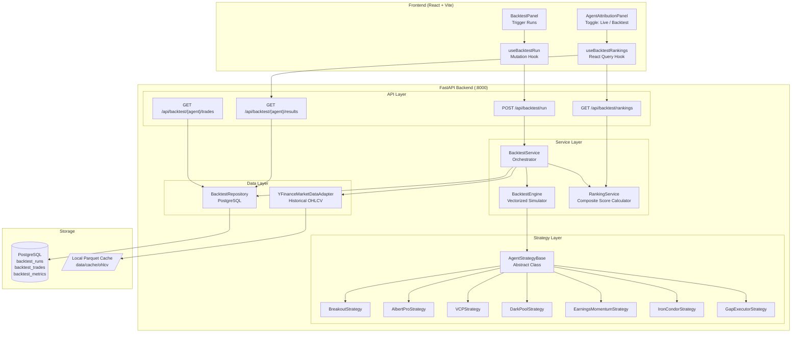
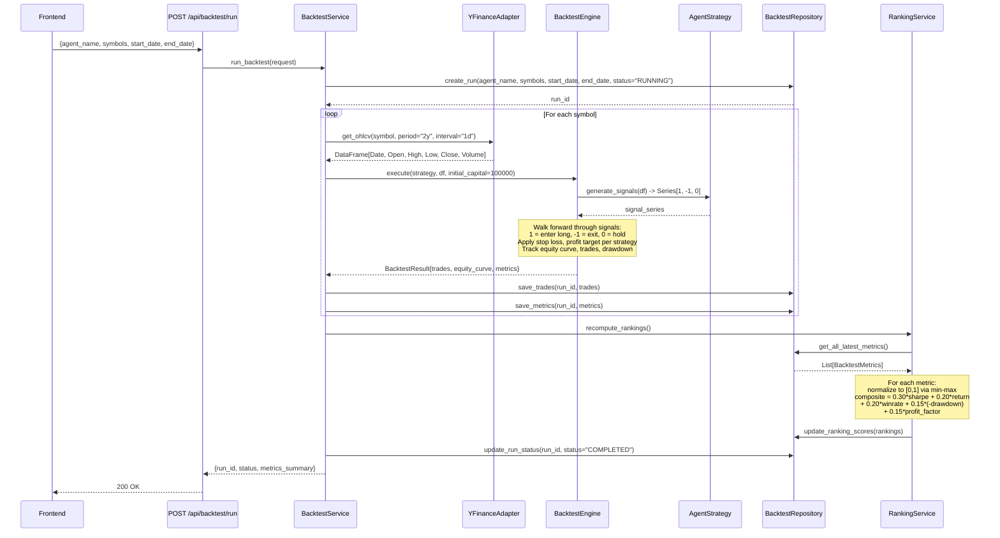
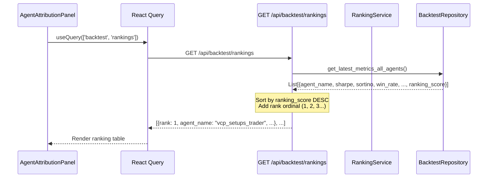
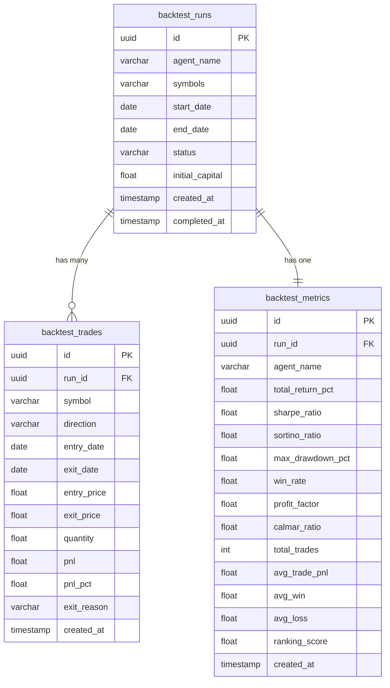

# Backtesting Engine -- Diagrams

---

## 1. System Component Diagram



---

## 2. Backtest Run Sequence Diagram



---

## 3. Data Flow: Rankings Query



---

## 4. Strategy Signal Flow (per agent)

```mermaid
graph LR
    subgraph "Input"
        DF[DataFrame<br/>Date | O | H | L | C | V]
    end

    subgraph "Strategy: generate_signals()"
        IND[Compute Indicators<br/>SMA, RSI, ATR, etc.]
        COND[Apply Entry/Exit<br/>Conditions]
        SIG[Signal Series<br/>1=BUY, -1=SELL, 0=HOLD]
    end

    subgraph "BacktestEngine: execute()"
        POS[Position Tracker<br/>entry_price, qty, stop, target]
        EQ[Equity Curve<br/>daily NAV]
        TL[Trade Log<br/>entry, exit, pnl]
        MET[Metrics Calculator<br/>Sharpe, Sortino, DD, etc.]
    end

    DF --> IND --> COND --> SIG
    SIG --> POS --> EQ
    POS --> TL
    EQ --> MET
```

---

## 5. Database Entity Relationship


