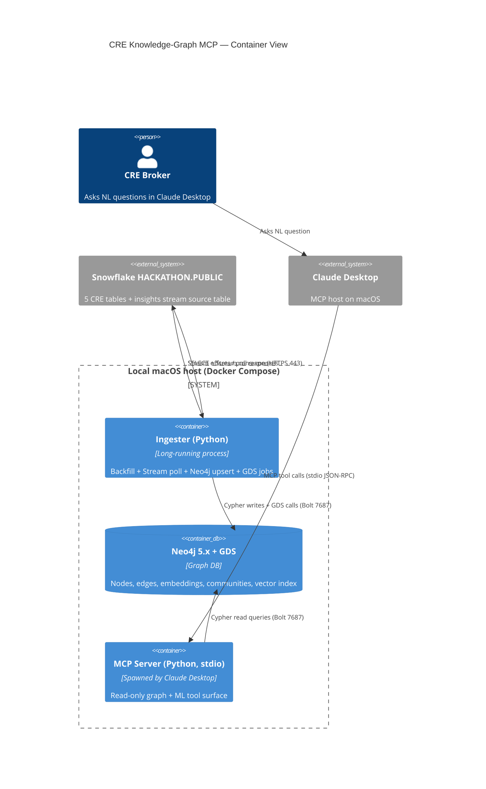
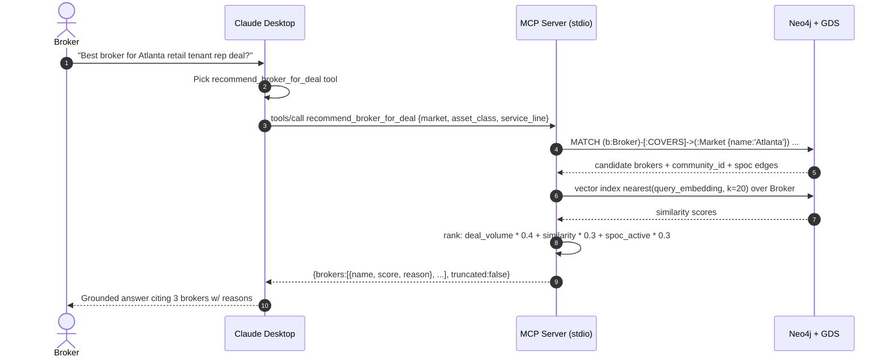
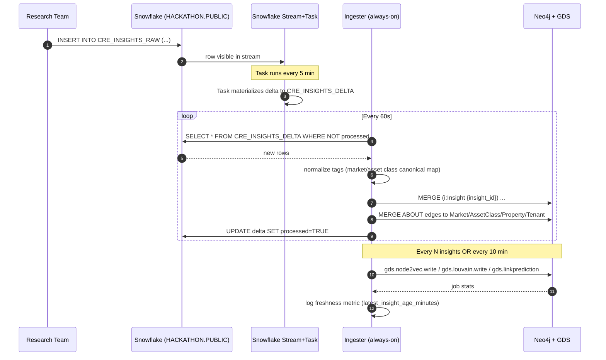
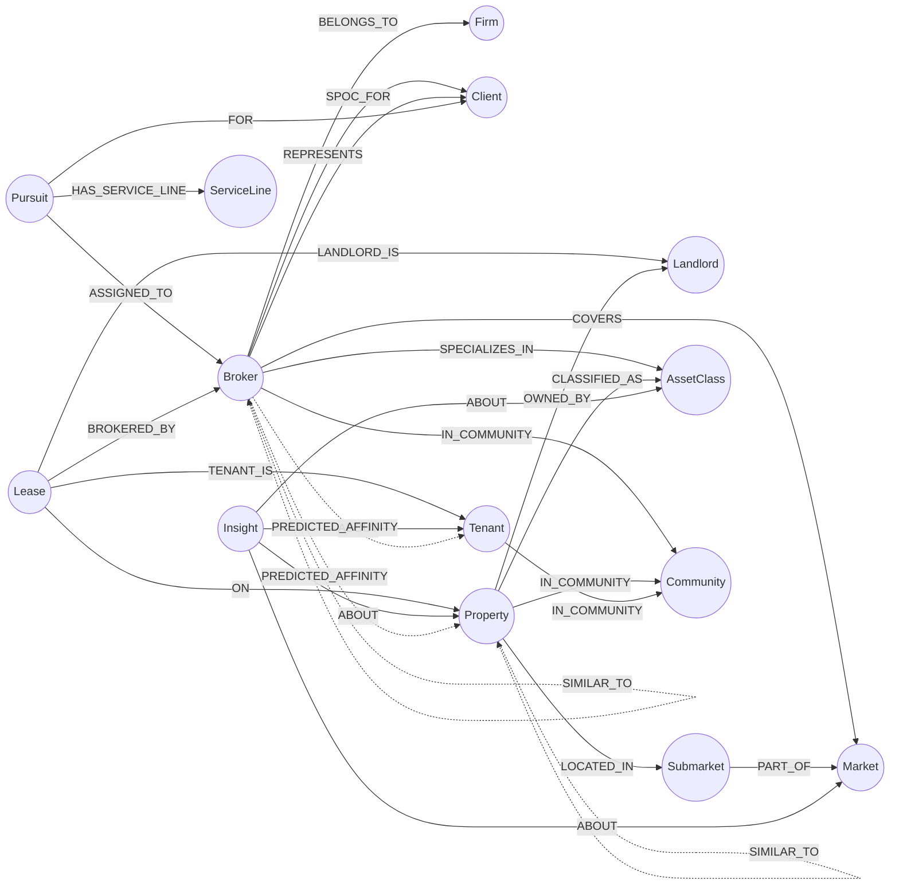

# CRE Knowledge-Graph MCP Server — Architecture

| Field | Value |
|---|---|
| Owner | harishlearning2@gmail.com |
| Date | 2026-05-05 |
| Mode | Hackathon Prototype |
| Status | Architecture v1 — locked for build |

---

## 1. Context

CRE brokers cross-reference 5 fragmented Snowflake tables (`HACKATHON.PUBLIC.CRE_BROKERS`, `CRE_PROPERTIES`, `CRE_LEASE_COMPS`, `CRE_PURSUITS`, `CRE_SPOC`) plus a streaming insight feed to answer three canonical questions about deals, brokers, and market intelligence. The architecture lifts this data into a Neo4j knowledge graph, enriches it with Graph Data Science (GDS) ML, and exposes intent-named tools to Claude Desktop via an MCP server. Everything must run end-to-end on a macOS laptop within 10 minutes of `git clone`.

---

## 2. Stack Decisions

### Python over Node
The Snowflake official driver, the Neo4j driver, and the Neo4j GDS Python client are all first-class in Python. The Anthropic MCP Python SDK is mature. Node would force us to shell out for ML work (Node2Vec/GraphSAGE) or call GDS via raw Cypher with worse ergonomics. Python keeps ingestion, ML enrichment, and MCP tool implementation in one language with one dependency manager (`uv` or `pip` + `pyproject.toml`).

### Neo4j + GDS
Neo4j Community Edition runs in a single Docker container, has a managed GDS plugin distribution, supports vector indexes natively (5.11+), and natively executes Louvain, Node2Vec, and link prediction algorithms without writing model code. At 100K–500K nodes and low-millions edges, a single instance with default heap (4G) is adequate. No clustering. The GDS license terms permit hackathon/non-production use of the full algorithm library via the Neo4j GDS Community plugin (algorithms used here — Node2Vec, Louvain, link prediction features — are all in Community).

### MCP Transport: stdio
Claude Desktop launches stdio-MCP servers per session. We use stdio for simplicity (no port management, no auth shim). **Critical implication:** stdio MCP servers only run while Claude Desktop has them open, so they cannot also be the always-on Snowflake ingester. The 5–15 min freshness SLO requires a separate continuously-running process. We split into two Python processes (see Section 3).

### Always-on Ingester vs On-demand MCP Server
- **Ingester**: a separate Python process started by `docker compose up`. Does Snowflake polling, Stream+Task consumption, Neo4j upserts, and ML enrichment refreshes. Owns all writes to Neo4j.
- **MCP server**: stdio process spawned by Claude Desktop on session open. Read-only against Neo4j. Stateless. Multiple MCP server instances can coexist if multiple Claude sessions are open; only the ingester writes.

This separation removes the freshness-vs-session-lifetime conflict and makes the MCP server trivially restartable.

---

## 3. Container Diagram (C4)



---

## 4. Sequence — User NL Question → MCP Tool → Response



---

## 5. Sequence — Streaming Insight → Graph Refresh



---

## 6. ER-style Ontology Graph



Solid edges = source-of-truth. Dotted edges = ML-derived.

---

## 7. Components

| Component | Process | Responsibility |
|---|---|---|
| `ingester.snowflake_client` | Ingester | Auth, full backfill SELECTs, Stream/Task setup, delta polling |
| `ingester.normalizer` | Ingester | Canonical map for market/asset-class/service-line strings; entity-resolution merge keys |
| `ingester.graph_writer` | Ingester | Cypher MERGE/CREATE for nodes + edges; idempotent upserts |
| `ingester.ml_enricher` | Ingester | GDS calls: Node2Vec, Louvain, link prediction; writes back as node/edge properties |
| `ingester.scheduler` | Ingester | APScheduler loop: poll every 60s, ML refresh every 10 min OR 50-insight batch |
| `mcp.server` | MCP | stdio JSON-RPC; tool registration |
| `mcp.tools.*` | MCP | One module per tool: `health_check`, `cypher_query`, `semantic_search`, `find_matching_properties_for_insight`, `suggest_next_best_actions_for_deal`, `recommend_broker_for_deal`, `traverse_graph`, `list_communities`, `predict_links` |
| `mcp.graph_reader` | MCP | Read-only Neo4j session pool, query templates, vector index calls |
| `mcp.ranker` | MCP | Deterministic ranking helpers shared across recommend_* tools |

---

## 8. Resolved Ambiguities

### 8.1 Entity resolution / merge keys

| Entity | Canonical merge key | Rationale |
|---|---|---|
| Broker | `lower(trim(broker_email))` if present, else `lower(trim(broker_name)) + "::" + lower(firm_name)` | Email is unique when present; (name, firm) tuple disambiguates same-name brokers across firms. CRE_BROKERS provides email; CRE_SPOC may not — fall back. |
| Property | `coalesce(property_id, lower(normalize_address(address_line1) + "::" + lower(zip)))` | CRE_PROPERTIES has a stable property_id; CRE_LEASE_COMPS may reference by address. Address normalization strips suite/unit, lowercases, collapses whitespace. |
| Tenant | `lower(trim(tenant_name))` with optional `+ "::" + lower(industry_code)` collision-breaker | Hackathon-acceptable. Tenants have no public stable ID in source. |
| Landlord | `lower(trim(landlord_name))` | Same reasoning as Tenant. |
| Lease | `lease_id` if present, else hash(`property_merge_key`, `tenant_merge_key`, `execution_date`) | Lease is a fact record; identity is the (property, tenant, date) tuple. |
| Pursuit | `pursuit_id` (assumed present in CRE_PURSUITS) | Trust source PK. |
| Client | `lower(trim(client_name))` + optional `account_type` | Same as Tenant — accept some over-merging at hackathon scale. |
| Market / Submarket / AssetClass / ServiceLine / Firm | `lower(trim(name))` against canonical-map dictionary | Normalization map lives in `ingester/canonical_map.yaml`; new unmapped values create a new node and log a warning. |
| Insight | `insight_id` from source row | Source must provide UUID/PK. |

Apply via `MERGE (n:Label {merge_key: $key}) SET n += $props, n.last_seen = timestamp()`. Constraints in §`data-model.md`.

### 8.2 Insight tagging normalization schema

`Insight` node properties:
```
insight_id: string (PK)
title: string
body: string
source: string          // e.g. "Research Team", "External Newsletter"
published_at: datetime
ingested_at: datetime
sentiment: string?      // optional
raw_tags: list<string>  // verbatim from source
embedding: list<float>  // populated by ML enricher
```

Tags normalize via `canonical_map.yaml`:
```yaml
markets:
  "Dallas-Fort Worth": [DFW, "Dallas/Ft Worth", "Dallas Ft Worth"]
asset_classes:
  Industrial: [industrial, IND, "Logistics & Industrial"]
  Office: [office, OFF]
service_lines:
  TenantRep: ["Tenant Rep", "Tenant Representation", "TR"]
```
Resolution algorithm:
1. For each tag in `raw_tags`, lower+trim, match against canonical_map values.
2. On match, create `(:Insight)-[:ABOUT]->(:Market|:AssetClass|...)` to the canonical node (MERGE).
3. On no-match, MERGE a new node of best-guessed label and log a warning. Phase 2 exit criterion includes review of the warning log.
4. If tag begins with "tenant:" or "property:", resolve via Tenant/Property merge keys.

### 8.3 Embedding algorithm — **Node2Vec**

Justification:
- Node2Vec is in Neo4j GDS Community; GraphSAGE requires GDS Enterprise for `gds.beta.graphSage.train` with multi-property feature support. Hackathon = no enterprise license.
- Node2Vec is unsupervised; no training labels needed. We do not have ground-truth similarity pairs.
- 100K–500K nodes: Node2Vec writes 128-dim embeddings in <2 min on a laptop with `walkLength=80, walksPerNode=10`.
- Cold-start safe: works from graph structure alone; no feature engineering required.
- Tradeoff accepted: Node2Vec ignores node attributes (only structure). For v1 this is fine — Q1/Q2/Q3 are answered by structural similarity (who shares markets/clients/asset classes). If attribute richness becomes critical post-hackathon, swap to GraphSAGE on GDS Enterprise — interface is identical (write `embedding` property), so MCP tools do not change.

Configuration:
```
gds.node2vec.write({
  embeddingDimension: 128,
  walkLength: 80,
  walksPerNode: 10,
  iterations: 5,
  writeProperty: 'embedding'
})
```
Run on projection of (Broker, Property, Tenant, Insight) ∪ (COVERS, SPECIALIZES_IN, REPRESENTS, BROKERED_BY, ON, TENANT_IS, ABOUT, LOCATED_IN, CLASSIFIED_AS).

### 8.4 ML enrichment trigger — **Scheduled, 10-minute cadence with batch-size override**

Pure event-driven rebuilds embeddings on every insight insert — wasteful and expensive at GDS run time of ~1–2 min. Pure scheduled may waste compute when nothing changes.

**Decision:** Run on a 10-minute fixed schedule **OR** when ≥50 new insights have landed since last run, whichever first. This satisfies the 5–15 min SLO (graph upserts happen on the 60s ingest poll; ML lag of 10 min is acceptable since traversal tools fall back to structural queries when embedding-based ranking is stale). Implementation: APScheduler `IntervalTrigger(minutes=10)` + counter check.

### 8.5 `traverse_graph` cap — **200 nodes / 500 edges, 3-hop max, ordered**

Rationale:
- Claude Desktop MCP responses comfortably handle ~50KB. 200 nodes × ~250 bytes each + 500 edges × ~120 bytes = ~110KB; trim to ~50KB by emitting only `{id, label, name}` per node and `{from, to, type}` per edge.
- 3 hops is the deepest meaningful CRE traversal (Broker → Client → Pursuit → Property = 3 hops).
- Tool returns `truncated: true` and a follow-up token if cap is hit. Claude can re-call with a narrower start node.

---

## 9. Security Posture (Hackathon Caveats — Explicit)

| Concern | Hackathon stance | Production gap |
|---|---|---|
| Snowflake auth | ACCOUNTADMIN credentials in `.env`, gitignored | Replace with key-pair auth + reduced role scoped to HACKATHON.PUBLIC SELECT |
| Neo4j auth | Default `neo4j/neo4j` password rotated to a value in `.env` | TLS + non-default user, secrets in vault |
| MCP transport | stdio only, no network exposure | If HTTP transport added: mTLS + bearer tokens |
| `cypher_query` tool | Documented as DESTRUCTIVE — runs arbitrary Cypher including writes | Production must remove or restrict to read-only via dedicated Neo4j role |
| PII | Broker emails, client names present in graph | Production must mask in MCP responses unless caller is authorized |
| Logs | stdout only; may include node names | Production: structured JSON logs, no raw PII |
| `.env` file | In repo root, gitignored, committed `.env.example` template | — |

---

## 10. Failure Modes

| Failure | Detection | Behavior |
|---|---|---|
| Snowflake unreachable | Ingester connect fails | Exit non-zero on backfill; on poll, log + retry with exponential backoff (max 5 min) |
| Neo4j down | Ingester or MCP Bolt connect fails | Ingester retries every 30s; MCP server returns `health_check` status `DEGRADED` with reason |
| GDS plugin missing | `CALL gds.list()` fails on startup | Ingester logs FATAL and exits; docker-compose health check fails |
| Insight tag unmappable | normalizer logs warning | Insight node still created; ABOUT edges only to nodes that resolved; warning surfaces in `health_check.warnings` |
| Embedding stale (>30 min) | health_check checks `last_ml_run_at` | `health_check.status = "OK"`, `ml_freshness_warning = true` |
| `traverse_graph` exceeds cap | tool computes node count pre-return | returns `truncated: true` and partial result |
| MCP server crashes | Claude Desktop reports tool error | User sees degraded-tools warning; ingester continues independently |
| Ingester crashes | `health_check` reports `latest_insight_age_minutes > 15` | Demo presenter restarts ingester via `docker compose restart ingester` |

---

## 11. ADRs (compact)

**ADR-001: Two-process split (ingester + MCP).** Status: Accepted. Driver: stdio MCP lifetime tied to Claude session, conflicts with always-on ingest. Alternatives: HTTP MCP (rejected — adds auth surface for hackathon); single process with background thread (rejected — Claude Desktop can spawn multiple MCP servers, only one should write).

**ADR-002: Node2Vec over GraphSAGE.** Status: Accepted. Driver: GDS Community licensing. See §8.3.

**ADR-003: Scheduled ML refresh, not event-driven.** Status: Accepted. See §8.4.

**ADR-004: Canonical-map normalization for taxonomy nodes.** Status: Accepted. Driver: insight tags arrive with inconsistent strings.

**ADR-005: `cypher_query` is shipped despite write risk.** Status: Accepted, hackathon only. Driver: unblocks live debugging during demo. Mitigation: documented danger in tool description; remove in any non-hackathon deployment.

---

## 12. Rollback Strategy

The ingester writes to Neo4j only. To roll back any phase:

1. **Phase 1 rollback:** `docker compose down -v` drops the Neo4j volume; re-run backfill.
2. **Phase 2 rollback:** Drop the Snowflake Stream and Task: `DROP STREAM HACKATHON.PUBLIC.CRE_INSIGHTS_STREAM; DROP TASK HACKATHON.PUBLIC.CRE_INSIGHTS_TASK;`. Delete Insight nodes: `MATCH (i:Insight) DETACH DELETE i;`.
3. **Phase 3 rollback:** Remove ML properties: `MATCH (n) REMOVE n.embedding, n.community_id; MATCH ()-[r:SIMILAR_TO|PREDICTED_AFFINITY|IN_COMMUNITY]-() DELETE r;`.
4. **Phase 4 rollback:** Disable specific MCP tools in `mcp/server.py` registration list; restart Claude Desktop.

All Snowflake artifacts created (Stream, Task, processed-flag table) are listed in `docs/tech-plan.md` so they can be removed cleanly.

---

## 13. Prerequisites Flagged

- **Working directory is not a git repo.** Phase 1 first task is `git init` + initial commit + `.gitignore` (`.env`, `*.pyc`, `__pycache__/`, `.venv/`, `neo4j_data/`).
- macOS host with Docker Desktop installed and running.
- Python 3.11+ (Neo4j GDS Python client requires ≥3.9; use 3.11 for typing).
- Claude Desktop installed; user has write access to `~/Library/Application Support/Claude/claude_desktop_config.json`.
